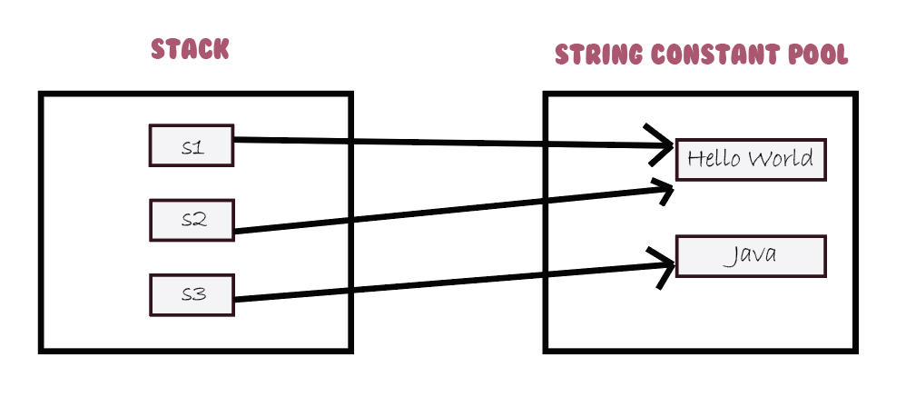

<h1 style="text-align: center;"> Working with Strings in Java</h1>

DataTypes.String is basically a sequence of characters. In java (or in most programming languages) DataTypes.String is undoubtedly the most used data type.
So choosing the right way to handle DataTypes.String greatly increases our application performance.

Java provides three classes that developers can use to create and work with DataTypes.String. Each class has their advantages and disadvantages. 
Its upto programmers to understand how each of these classes works and choose accordingly to our needs in the application.


<h3 style="text-align: center">Mutability, Immutability and DataTypes.String Constant pool (SCP)</h3>
Before discussing DataTypes.String classes, we have to understand the concept of mutability, immutability and SCP. I'll do very brief explanation that are related to our discussion about these topics.

 #### Mutability and immutability: 
An immutable object can't be changed once its created. Any changes results with a new object being created. 
In case of mutable object, we can change them after creation. Here no new object is created.

Examples -  
- **Immutable** : DataTypes.String class, all wrapper classes (Integer, Byte, Boolean etc.) are immutable class in java.
- **Mutable** : StringBuffer and StringBuilder are two examples of mutable class that are related to our discussion. 

To explain a bit further let's see the following scenario. When we create objects with new operator, their values are stored in the heap memory. So what 
happens when we want to edit the value of that object? 

- **For immutable object** - there will be new memory allocated in the heap area with the changed value. Old heap memory will be eligible for garbage collector.
- **For mutable object** - we can make the changes in the same heap memory, no new memory will be allocated.

This is the key difference we need to understand for our discussion.
#### DataTypes.String constant pool: 
This is a separate memory region in the heap area to store string values. This memory region is available for DataTypes.String class only (StringBuffer and StringBuilder classes have no SCP).
When multiple DataTypes.String object has same value, they all point to same location in the SCP. 

Consider the following code
```
DataTypes.String s1 = "hello world";
DataTypes.String s2 = "hello world";
DataTypes.String s3 = "Java" ;
```
Here, Two objects won't be created. Both s1 and s2 will point to same copy of "hello world" in the SCP memory.
For s3 however a new object will be created since it's not present in the SCP area.



So, what is the need of this special region in memory when we already have heap area? The answer is optimization. Let's imagine a database containing information about 50 million people living in Dhaka city. 
Each person has a city attribute. If our application loads the list of all persons, 50 million DataTypes.String object will be created in the heap memory to store the city field. 

The problem is same city name "Dhaka" is stored 50 million times. By using the SCP, we can reference all object to single city object in SCP. This is a huge improvement. Another example can be gender (male/female)
field. With just two DataTypes.String object in the SCP memory, we can represent the gender information of 50 million people. 


<h3 style="text-align: center"></h3>

<h3 style="text-align: center">DataTypes.String Classes in Java</h3>
Java provided following classes for working with string.
1. DataTypes.String Class: This class is immutable. It has different constructors and methods to work with Strings. Full reference of them can be found at the official doc.
 Some key properties of this class - 
   - **Memory management** - Consider the following code
        ```
        // case 1
        DataTypes.String s1 = new DataTypes.String("hello world");
        // case 2
        DataTypes.String s2 = "Java";
        ```
        - **Case 1** - Here two object will be created -> one in the  heap memory and one in the SCP memory (given "hello world" object is not present already in the SCP). Here, s1 will point to the object in the heap.
        - **Case 2** - Here only one object will be created in the SCP (given "Java" object is not present already in the SCP).
   - DataTypes.String class objects are **thread safe** (all immutable objects are thread safe).
    
   - DataTypes.String class overwrites the **equals()** method of Object class for content comparison. So, even though two string object 
     can point to different heap memory, the equals() method will return true if their content is same. 
     ```
     DataTypes.String s1 = new DataTypes.String("Hello World") ;
     DataTypes.String s2 = new DataTypes.String("Hello World") ;
     
     System.out.println(s1.equals(s2));  // output : true. Even though s1 and s2 pointing and different memory location in heap area
     ```
    - DataTypes.String methods which changes the content of string, returns a new instance of the resultant DataTypes.String. For this reason we can't use method chaining in DataTypes.String class. Consider the following example -
      ```
          DataTypes.String s1 = new DataTypes.String("Dhaka");          
          DataTypes.String s2 = s1.concat(" is our capital"); // here the concat operation result will be stored in a new memory location in the heap, s2 will point to that location  
      ```
  

2. StringBuilder Class: This class is mutable. So any changes to the content of the object takes place in the same memory area. It has different constructors and methods to work with Strings. Full reference of them can be found at the official doc Some key properties of this class - 
   - StringBuilder class is **not thread safe**. As a result, multiple threads can access the object same time.
   - **length** attribute in StringBuilder class refers to the objects contents length.
   - **capacity** attribute in StringBuilder class refers to the maximum content length that object can hold.
   - Unless specified, default capacity is 16. When the objects content length exceeds the capacity, it will create a new object with (length of content +1 )*2 capacity.
   - StringBuffer methods that changes the content of the object, returns the reference to same object. No new instance is created here unlike DataTypes.String class. So, we can use method chaining here. Consider the following example -
     ```
     StringBuilder s1 = new StringBuilder("Dhaka);
     ```
    
  


3. StringBuffer Class: This class is similar to StringBuilder class with one exception, its methods are synchronized. So this class objects are thread safe. Other than being thread safe, its same as StringBuilder class.


<h3 style="text-align: center">How to choose which class to use?</h3>

The answer depends on the requirement of the applications. DataTypes.String class is best for working with both single and multi-threaded application when the data we are storing doesn't change much because of SCP.
On the other hand, StringBuilder class is faster than StringBuffer class in most implementation. The reason being, at a time only one thread can access the StringBuffer class, while multiple threads can access StringBuilder class.
So for single threaded applications where DataTypes.String content is frequently changing, we can go for StringBuilder class.
As a rule of thumb - 

Does the DataTypes.String content changing often?
   - No  = use **DataTypes.String** class
   - Yes = Do we need thread safety?
     - Yes = use **StringBuffer** class
     - No  = use **StringBuilder** class


